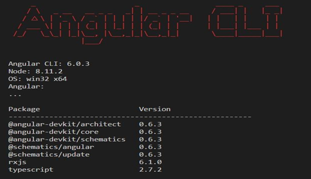
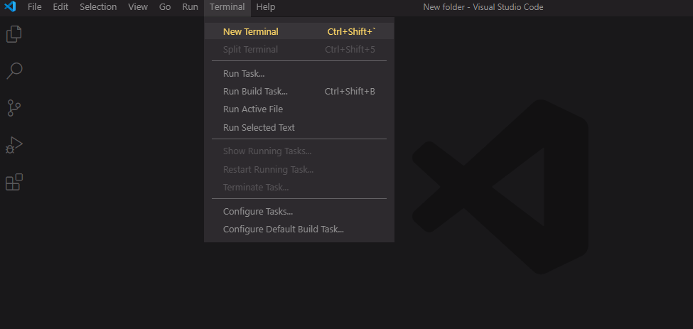

# <center>Angular гарын авлага</center>

## Агуулга

- [Angular гэж юу вэ?](#1.-Angular-гэж-юу-вэ?)
- [Angular CLI хэрхэн суулгах вэ?](#2.-Angular-CLI-суулгах-нь:)
- [Angular CLI дээр хэрхэн project үүсгэх вэ?](#3.-Angular-CLI-дээр-project-үүсгэх-нь-:)
- [Angular архитектур болон бүтэц](#4.-Angular-архитектур-болон-бүтэц)

---

## 1. Angular гэж юу вэ?

- Angular бол JavaScript фреймворк бөгөөд вэб аппликейшн бүтээхэд зориулагдсан.

* **Angular CLI** нь project шинээр үүсгэх, тест хийх, файл нэмэх, хөгжүүлэгч орчинд deployment хийх гэх мэт боломжуудыг агуулж эдгээрийг terminal/console орчноос коммандаар ажиллуулагч багаж юм.

[Дээшээ буцах](#<center>Angular-гарын-авлага</center>)

---

## 2. Angular CLI суулгах нь :

- Хэрэв таны компьютерт **Node.js** суулгаагүй бол эндээс суулгана уу. [Link](https://nodejs.org/en/)

* Node.js суусан эсэхийг шалгахыг хүсвэл Command prompt-ыг онгойлгон **node -v** гэж бичин шалгах боломжтой.


- Үүний дараа Command  prompt дээрээ **npm install -g @angular/cli** гэж бичин enter товчийг дарж Angular CLI суулгах процессыг эхлүүлнэ. 


>Дээрх коммандууд бүрэн ажиллаж дуусахад багагүй хугацаа шаардах тул тэвчээртэй хүлээх хэрэгтэй.

- _Angular CLI_ суусан эсэхийг шалгахыг хүсвэл Command prompt дээр **ng v** гэж бичин шалгах боломжтой.



 - Үүнээс гадна хөгжүүлэгчид бидэнд ямар project/кодчилол хөгжүүлэгч программ ашиглаж цаг хэмнэх болон илүү өргөн боломжуудыг ашиглах зэрэг нь чухал зүйлүүд билээ. Angular project хөгжүүлэхэд тохиромжтой программ бол **Visual Studio code** юм.

* Учир нь бүх үйлдлийн систем дээр ажилладаг ба debug хийх, олон тооны terminal/console ашиглах, алдартай plugin/extension-үүдийг ашиглахад хялбар гэх мэт өргөн боломжуудыг агуулсан байдаг. [Link](https://visualstudio.microsoft.com/downloads/)

[Дээшээ буцах](#<center>Angular-гарын-авлага</center>)

---

## 3. Angular CLI дээр project үүсгэх нь :

- Эхлээд шинээр folder үүсгэнэ. Дараа нь vscode-ыг уншуулан тэрхүү folder-ыг онгойлгоно.


- Үүний дараа vscode-ын terminal-ыг ажиллуулна.



- Тerminal дээрээ **ng new** _project name_ гэж бичин project үүсгэнэ.
 
- Дараа нь **cd** _project name_ гэж бичин тухайн project-ийн директор дотор орно.

- Project-доо ажиллуулахын тулд **ng serve** гэж terminal дээр бичин ажиллуулна.

- **ng serve** комманд нь сервер программыг ажиллуулж мөн тухайн project доторх файлуудыг ажиглаж байдаг ба шинэ өөрчлөлт орсон үед автоматаар дахин project-г build хийдэг. 

- Үүний дараа өөрийн ашиглаж буй вэб хөтөч дээрээсээ **localhost:4200**-луу хандана. 

- Хэрэв таньд тухайн **project app works!** мессежээр мэндчилж байвал таньд баяр хүргэе! та анхны алхмыг амжилттай гүйцэтгэлээ :)

[Дээшээ буцах](#<center>Angular-гарын-авлага</center>)

---

## 4. Angular архитектур болон бүтэц

- HTML template-үүдийг Angular-жсан тэмдэглэгээт хэлээр **(ngFor, {{name}} , (click) etc.. )** бичиж , үүнийгээ **component** классуудаар өгөгдлийн эргэх холбоо буюу **data  binding** хийх зарчмаар удирдуулна. 

- Ингэхдээ **metadata** дотор ямар нөхцөл байдалд юуг агуулж болох талаар тодорхойлж бичсэнээр Angular хэрхэн тухайн component классыг ажиллуулах тухайгаа мэдэж авдаг. 


- **Application logic** буюу программ хэрхэн ажиллах талаарх бүр нарийн логик дэс дарааг **service класс** дотор тусгаж тооцооллыг хийнэ. 

- Хэдийгээр **application logic**-г component класс дотор оруулах боломжтой ч бид олон удаа ашиглагдах шаардлагатай өгөгдөл эсвэл функцуудыг дахин дахин тодорхойлон үүсгэхээс зайлс хийх зорилготойгоор **service классыг** ашиглах ёстой. 

- Үүний тулд **dependency injection** гэх ойлголтыг хэрэглэдэг. Эдгээр **component** болон **service классуудыг** нэгтгэн хайрцаглаж **module** дотор оруулна. 

- Дараагийн алхам бол нийт **module**-ууд дундаас эхлэл болсон **root module** -г сонгон үүнийгээ **bootstrapping** хийн программаа ажиллуулна.

>Жишээ:

- Module

```
root -> src/app/app.module.ts
bootstrapping -> src/main.ts
```

- Service

```
src/app/employee.service.ts
```

- Components

```
src/app/app.component.ts
src/app/department.component.ts
src/app/employees.component.ts
```

- HTML templates

```
src/app/app.component.html
src/app/department.component.html
src/app/employees.component.html
```

[Дээшээ буцах](#<center>Angular-гарын-авлага</center>)

---

## Зөвлөмж

- Алхам алхмаар ахих түвшний хичээлүүдийг бүрэн судлаж мэдлэгээ зузаатгана уу.
- Angular сурах хэцүү санагадаж байвал html , css , javascript-ын мэдлэгээ зузаатгаарай.

<style>
*{
font-family: Arial, Helvetica, sans-serif;
}
ul{
    font-size:15px;
}
center{
    font-size:38px;
    padding-bottom:20px;
}
p{
    font-size:16px;
}
img{
    display: block;
    margin-left: 10%;
    margin-right: auto;
    margin-top:10px;
    margin-bottom:20px;
    width:60%;
}
h2{
    margin:20px 0;
}
</style>
